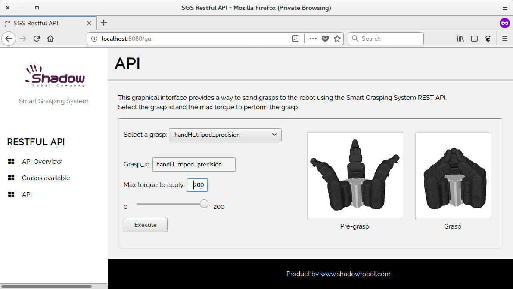
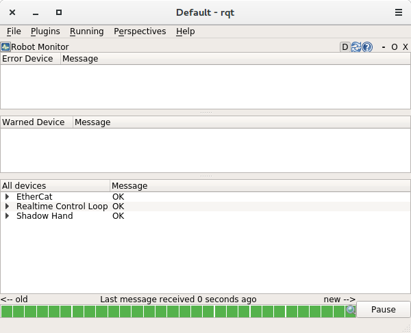
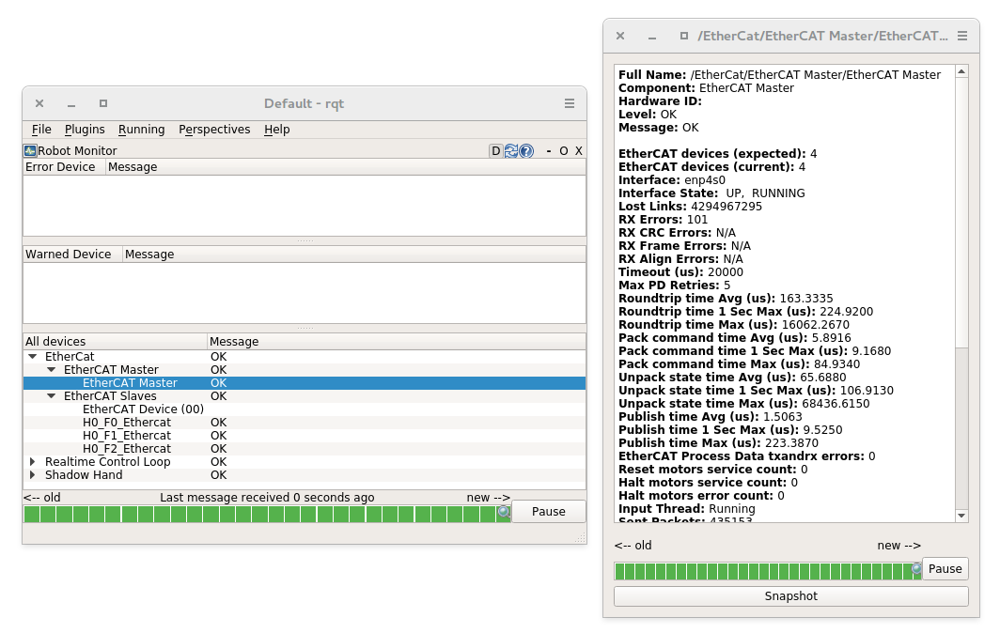
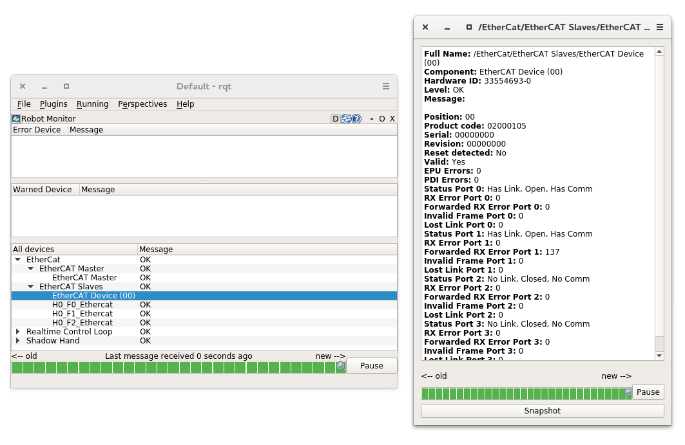
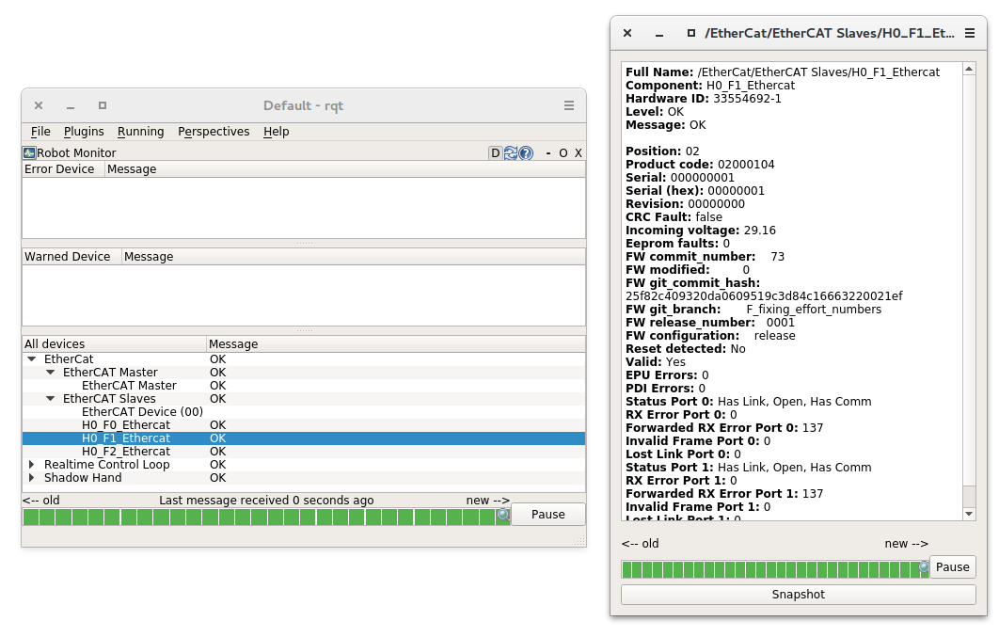
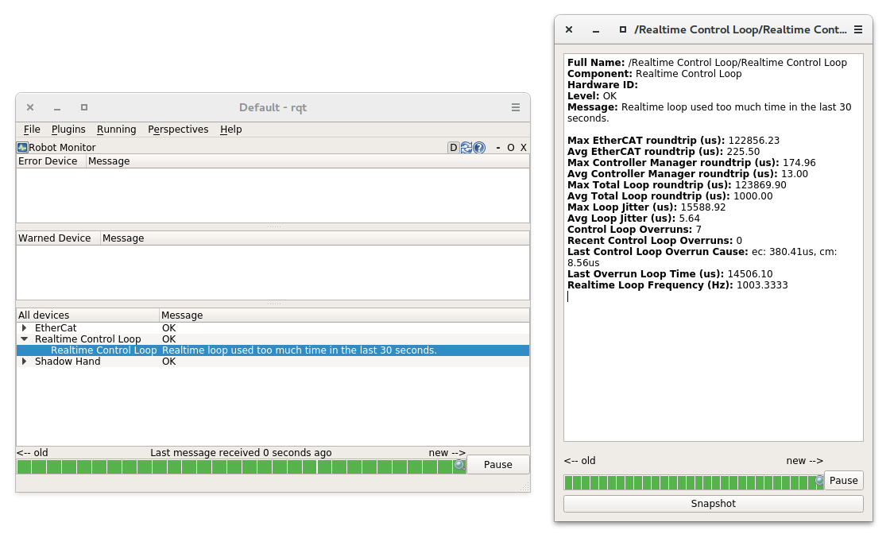
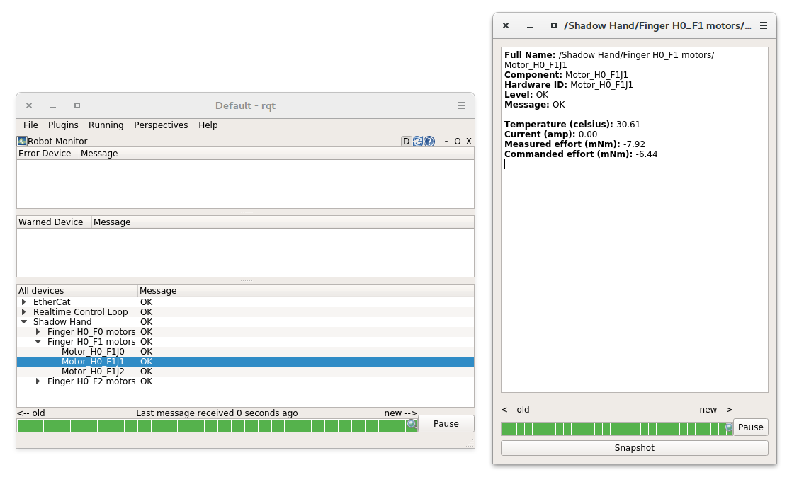

## First time users
If you are unfamiliar with ROS, it is highly recommended that you read the [ROS Tutorials](http://www.ros.org/wiki/ROS/Tutorials).

If you are unfamiliar with the terminal on Linux, you should look [here](https://askubuntu.com/questions/183775/how-do-i-open-a-terminal).

Shadow software is deployed using Docker. Docker is a container framework where each container image is a lightweight, stand-alone, executable package that includes everything needed to run it. It is similar to a virtual machine but with much less overhead. Follow the instructions in the next section to get the latest Docker container of the grasper up and running.

## Docker
### Installing the software on a new PC using the one-liner

We have created a one-liner that is able to install Docker, download the image and create a new container for you. It will also create a desktop icon to start the container and launch the hand. To use it, you first need to have a PC with Ubuntu installed on it (preferable version 16.04) then follow these steps: 


#### Check your Grasper interface ID

Before setting up the docker container, the EtherCAT interface ID for the Grasper needs to be discovered. In order to do so, after plugging the Grasper’s ethernet cable into your machine and powering it up, please run

```bash
$ sudo dmesg
```

command in the console. At the bottom, there will be information similar to the one below:
   
```bash
[490.757853] IPv6: ADDRCONF(NETDEV_CHANGE): enp0s25: link becomes ready
```

In the above example, ‘enp0s25’ is the interface ID that is needed.

2. Get a docker ID

   You need to create a Docker ID here (if you do not have one already): [https://hub.docker.com/](https://hub.docker.com/)

   Then send an email with your ID to grasper@shadowrobot.com so we can grant you permission to pull the image.

3. Run the one-liner:

   The one-liner will install Docker, pull the image from Docker Hub, and create and run a container with the parameters specified. In order to use it, use the following command:

   ```bash
   bash <(curl -Ls http://bit.do/launch-sh) -i shadowrobot/agile-grasper:kinetic-release -n agile-grasper -sn Grasper_Launcher -e [EtherCAT interface ID]
   ```
   
   You will need to specify the EtherCAT interface ID that you found in the previous step. You can also add -r true in case you want to reinstall the docker image and container. It will prompt you for your Docker username and password before pulling the image. When it finishes it will show:

   ```bash
    Operation completed
   ```
   and it will create a desktop icon on your desktop that you can double-click to launch the Grasper. It will look like this:
   
   
   
### Using a PC that Shadow provided
In this case, the previous steps would have been performed by the Shadow team before, then the only thing to do to start the Grasper is to either double-click the desktop icon or to run the container using:

```bash
$ docker start agile_grasper
```

You can check the currently available containers using:
```bash
$ docker ps -a
```

The container will be ready when fingers move to the zero position. 

## Communicating with the Grasper

### Introduction

When the container is started, a RESTful API server is running to allow communication with the grasper. We currently have the following API methods available:


URL | Description | Method
--- | --- | ---
/joint_positions | Get the position for all joints of a robot | GET
/joint_position?joint_name=name | Get position for a specific joint | GET
/joint_positions | Set joint target positions | POST
/select_grasp | Select a grasp state | POST

### Using a browser
In order to use the API from your browser, please run the container and, in a host browser, type the following in the address bar: [localhost:8080](localhost:8080)
There will be three tabs available:
 - **API Overview**: It provides useful instructions on how to use the RESTful API
 - **Grasps available**: It checks the grasp database and provides information on the available grasps that are currently stored
 - **API**: It provides a graphical interface for controlling the grasper.
An example of how the API looks is shown in the following screenshot:



In order to perform a grasp, please follow these instructions:


|    | Action | Grasper reaction|
|--- | --- | --- |
|1   | Choose a grasp from the Select a grasp drop down | Grasper will immediately go to pre-grasp position |
|2   | Choose the maximum torque to apply. You can use either the slider or the edit box | - |
|3   | Place an object inside of the grasper and click Execute | Grasper will move to the grasp pose and squeeze to grasp the object |

### Using bash commands or python scripts

The RESTful API can also be used with bash commands and python scripts. Detailed information on how to use each function is available in the [API Overview](http://localhost:8080/help) webpage detailed in the previous section. You will also need to know the grasp ID - this can be found in the [Grasps available](http://localhost:8080/grasps) webpage. An example of a bash command to execute the pre-grasp for the handH_tripod_power grasp can be seen below:

```bash
$ curl -X POST -H "Content-Type: application/json" -d '[{"grasp_id": "handH_tripod_power", "grasp_state": "pre_grasp", "max_torque": 100}]' http://0.0.0.0:8080/select_grasp
```

Analogous example using python:

```python
import json
import urllib2

grasp_cmd = [{"grasp_id": "handH_grasp_1", "grasp_state": "pre_grasp", "max_torque": 100}]
req = urllib2.Request('http://0.0.0.0:8080/select_grasp')
req.add_header('Content-Type', 'application/json')
response = urllib2.urlopen(req, json.dumps(grasp_cmd))
```

## Grasper Status
The agile-grasper provides a graphical interface for monitoring the robot state using diagnostic messages. In order to use it, after launching the Grasper, run the following command in a separate terminal:

```bash
$ rqt
```

Then, in the top left corner select Plugins and from there, Robot Tools>Diagnostics Viewer, as in the following screenshot:


When the Diagnostics Viewer is launched, you will be able to see the following three fields:
* EtherCat
* Realtime Control Loop
* Shadow Hand



Every field is divided into sections and subsections. By double-clicking a subsection, a window pops up with the corresponding information. In the bottom of the Diagnostics Viewer there is a timeslot bar that shows the status of the Grasper. It should look green when everything is working correctly and change to yellow or red when there are some issues that need attention. 

The **EtherCat** field is divided in the **Ethercat Master** and Ethercat Slaves. The EtherCat Master subsection contains information regarding the EtherCat communication such as connected devices and RX and TX times and errors.



The EtherCat Device subsection contains general information regarding the EtherCat ports of the robot.



The **H#_F#_Ethercat subsections** contain specific EtherCat information for the specific fingers of the grasper, such as firmware details (release number etc), product code and port status.



The **Realtime Control Loop** subsection contains information regarding the real-time control loop of the driver.

 

The **Shadow Hand** field contains different subsections for each finger connected to the hand. Each finger contains subsections for each of its motors with information such as temperature, current and effort.



