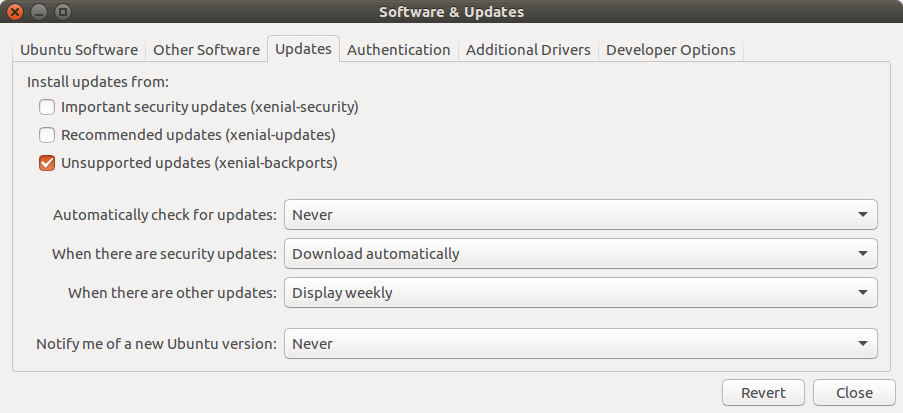

A list of common issues and how to resolve them.

## Hardware Issues

**How do I know when the Grasper is powered on?**

* There are lights on the back covers of the fingers. See 3.4
* The fans should be audible

**The Grasper is not powered.**

* Check all connections from the power supply to the Grasper

**All of the connections are OK. The Grasper still won’t power on.**

* Check that the plug socket is turned on and the mains lead is plugged in


**The Grasper STILL won’t power on.**

* Get in touch with someone from Shadow: grasper@shadowrobot.com


**The Grasper is powered but I cannot connect to my PC.**

* Check the ethernet cable connections
* Check the link light on your computer’s ethernet port (fixed state, not flashing)
* Check you’re using the right interface (see 9.2 ROS API Issues)

## Software Issues
### Docker

**I am getting following error when trying to pull the image:**
```bash
Error response from daemon: pull access denied for shadowrobot/flexible-hand:kinetic-release, repository does not exist or may require 'docker login'
```

Make sure that you are logged in to docker on your host machine using:
```bash
$ docker login
```
and type your credentials.

**I am getting following error when trying to run the image:**
```bash
docker: Error response from daemon: Conflict. The container name [name] is already in use
```
A container with your name already exists. Either remove the previous container using docker rm [name] or use docker start [name] to start the existing container. You can check the currently available containers, either running or stopped, using:

```bash
$ docker ps -a
```

**I am not getting any output from the Grasper in the console**

The verbose flag was missing when running the docker. Remove container and make sure you specify “-e verbose=true” in the docker run command.

**The Grasper doesn’t react after startup of the container**

* Make sure that interface ID is set correctly
* Power cycle the Grasper and try again

## Communicating with the Grasper

**I am getting the following error:**

```bash
Error: start: Cannot start container [container_id]: Port already in use: 8080
```

Port 8080 is used by RESTful API. Make sure that you are not already running another container using this port or that you are not occupying it in any other way.

**I am getting the following error when sending a grasp:**

There was a problem publishing the grasp command.
Check that the name of the grasp is correct and that the grasp is available in the database running the following command:

```bash
$ curl -i -H "Accept: application/json" -H "Content-Type: application/json" -X GET http://0.0.0.0:8080/grasps_available
```

**I am getting the following error when launching the driver:**
```bash
low_level_txandrx:failed 10 times: Giving up
[ERROR]: Error sending counter frame
[ERROR]: Something went wrong while scanning network
[INFO]: EtherCAT_AL:: Can't init network
[FATAL]: Unable to locate any slaves
```
A recent Ubuntu kernel release (**4.15.0-33-generic #36~16.04.1-Ubuntu**) affected the communication between the computer and our hands. We are currently investigating this issue but, in the meantime to keep working with our hands, you can downgrade to the previous kernel easily by following the instructions below (only if you are affected by this bug):

* Check what kernel do you have running the following command:
  ```bash
  uname -a
  ```
  If it is the same as mentioned above then you probably will have problems connecting with our hand. Follow the next steps to revert the kernel to an older version.
* Reboot your computer
* Keep holding down the Shift Key until you see the Grub menu - If not restart the computer and try again
* Navigate to the Advanced options and select to boot with an older kernel. For example: 4.15.0-32-generic #35~16.04.1-Ubuntu but it might be different on your computer, just select the one before the latest that causes the problem.
* Select this older kernel and press enter

When the system boots, test that the hand works. If it works fine then the last step is to remove the buggy kernel from your system otherwise it will get used on next system boot. So before you restart or shutdown the computer make sure you delete the buggy kernel: 
```bash
sudo apt-get purge linux-image-4.15.0-33-generic
```
Then launch Software and Updates application and remove the Ticks from the option boxes as shown below:


